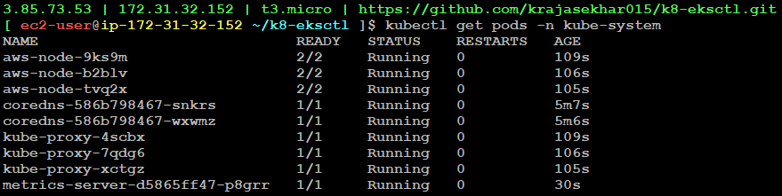
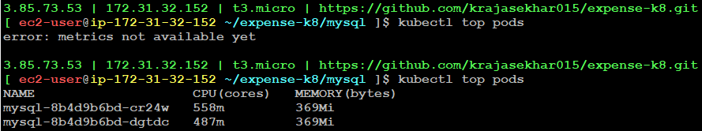
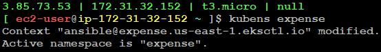

# Horizontal Pod Autoscaling

Scaling is of two types. They are:
    1. Horizontal Scaling
    2. Vertical Scaling

- Horizontal Scaling and Vertical Scaling are two approaches to increasing the capacity or performance of a system, typically used in the context of servers or cloud infrastructure. Both aim to handle increased load but do so in different ways.

- Suppose consider there is a building with ground floor and first floor. Due to increase in population we need to build four floors which is called vertical scaling. Otherwise build four individual buildings separetly which is called horizontal scaling.

- Suppose, the old house gets any problem in the basement, then the whole house will be collapsed. 

**1. Horizontal Scaling**
Horizontal scaling is where we create multiple servers based on the traffic with zero downtime

- There is no single point of failure in horizontal scaling

**2. Vertical Scaling**
Vertical scaling is where we can increase the number of resources (such as CPU, RAM, or storage) in the same server

- There is downtime since there is only single machine (Stop the server then increase resources and then restart)

Suppose our application is running and traffic increases on application then we need to increase number of pods.

- In resource utilization, containers have an advantage of consuming resources dynamically. It also has a disadvantage of consuming all the server resources if anything goes wrong. So, we have discusssed about resource section (requests & limits) in docker

- If we don't set resource utilization, then we cannot measure CPU utilization.

**Summary**
|     Aspect      |                           Horizontal Scaling	                         |               Vertical Scaling                               |
|-----------------|--------------------------------------------------------------------------|--------------------------------------------------------------|
|Definition	      | Adding more instances (nodes) to distribute the load	                 | Increasing the resources of an existing instance             |
|How it works	  | Scale-out (more servers) or scale-in (fewer servers)	                 | Scale-up (more resources on one server)                      |
|Scalability	  | Highly scalable, easy to add/remove instances	                         | Limited by the maximum size of the machine                   |
|Cost Efficiency  |	Cost-effective, especially for growing workloads	                     | Potentially more expensive, especially for |large instances  |
|Fault Tolerance  |	Better, since multiple instances can handle failure	                     | Poorer, since it’s a single point of failure                 |
|Complexity	      | More complex, requires load balancing and managing distributed resources | Simpler to manage, less overhead                             |

 
 Before setting horizontal pod autoscaling, there are two conditions:
 * We should have metrics server installed 
 * We should mention resource section inside pod

**What is metric-server?** <br>
The Metrics Server is a Kubernetes add-on that collects resource usage data from nodes and pods in a Kubernetes cluster. It provides CPU and memory metrics, which are crucial for autoscaling, monitoring, and optimizing the performance of applications running within the cluster.

- If we give `top` command, we can see which process is consuming more resources like CPU, Memory
- If we want to know which pod is consuming more CPU & memory, then use the command 
```
kubectl top pods
```
- Before applying this command, we need to install metrics server.

## Installing Metrics Server

- Go to the following location
```
https://github.com/kubernetes-sigs/metrics-server
```
- Run the following command
```
kubectl apply -f https://github.com/kubernetes-sigs/metrics-server/releases/latest/download/components.yaml
```
- To list all the pods in the `kube-system` namespace of a Kubernetes cluster
```
kubectl get pods -n kube-system
```


- In the above image at the bottom, we can see that metric server has been got installed

- Now, create namespace and mysql pods
```
kubectl apply -f namespace.yaml
```
Now, go to `mysql` folder and apply the command
```
kubectl apply -f manifest.yaml
```

Now, apply the command
```
kubectl top pods
```
- First it will display as `error: metrics not available yet`. Re-run the command twice, then it will get as shown below


To set default namespace, we have to install a tool called `kubens`. Go to the following location:
```
https://github.com/ahmetb/kubectx
```
- Run the following commands:
```
sudo git clone https://github.com/ahmetb/kubectx /opt/kubectx
```
```
sudo ln -s /opt/kubectx/kubectx /usr/local/bin/kubectx
```
```
sudo ln -s /opt/kubectx/kubens /usr/local/bin/kubens
```




> Note: In general, HPA will only works for stateless applications, but won't work for stateful applications like database (mysql)

## Installing K9S Tool

**K9s is an open-source, terminal-based user interface (UI) for managing and interacting with Kubernetes clusters**. It provides an efficient and intuitive way to monitor and manage Kubernetes resources like pods, deployments, services, namespaces, and more, all from a command-line interface (CLI). The goal of K9s is to provide a simple, powerful, and fast way to interact with Kubernetes resources, while leveraging the familiar Kubernetes API and kubectl commands under the hood.

- Go to the following location
```
https://github.com/derailed/k9s
```
- Run the command
```
curl -sS https://webinstall.dev/k9s | bash
```


